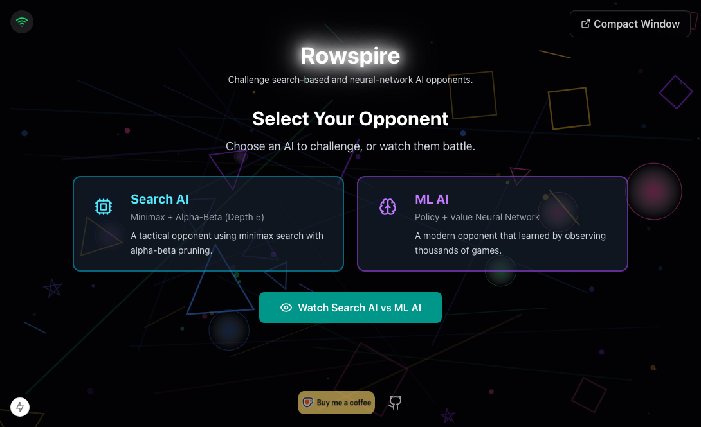

# Rowspire

Rowspire is an independent browser strategy game with Rust/WebAssembly AI opponents. It is a static React application built by Vite and served through Cloudflare Workers.



## Features

- Search and ML strategies running off the main thread in one validated AI worker.
- Rust/WebAssembly bitboard search, tactical guards and neural MCTS.
- Human vs AI and AI vs AI watch modes.
- Zustand + Immer command state with versioned, aggregate-validated persistence.
- Seedable AI and application effects for reproducible tests.
- Offline-first service worker with versioned WASM and model caching.
- Responsive React 19 UI with purposeful, reduced-motion-aware animation.
- Executable TypeScript/Rust rule conformance and production bundle budgets.

## Quick Start

Requires Node 22.12+, Rust, Cargo, `wasm-pack` 0.15 and `wasm-bindgen-cli` 0.2.122.

```bash
npm install
npm run dev
```

Vite runs at [http://localhost:5173](http://localhost:5173).

## Commands

| Command                    | Description                                                                |
| -------------------------- | -------------------------------------------------------------------------- |
| `npm run dev`              | Build AI/PWA assets and start Vite with the Cloudflare runtime             |
| `npm run build`            | Validate and create the deployable Vite/Worker artifact                    |
| `npm run check`            | Run lint, types, Rust, coverage, audits, build and production-artifact E2E |
| `npm run test`             | Run Vitest unit tests                                                      |
| `npm run test:rust`        | Run Rust tests                                                             |
| `npm run test:e2e`         | Build and run Playwright against the production preview                    |
| `npm run check:types`      | Reject stale generated Rust transport bindings                             |
| `npm run audit:bundle`     | Enforce compressed JS, CSS, WASM and model budgets                         |
| `npm run diagrams`         | Render standardized Graphviz architecture diagrams                         |
| `npm run train`            | Run feature-gated model training under `caffeinate`                        |
| `npm run deploy`           | Build and deploy with Wrangler                                             |
| `npm run smoke:production` | Verify the live shell, PWA, AI assets and canonical redirect               |

## Architecture

- UI: React 19 built by Vite.
- State: vanilla Zustand store factory, Immer commands and injected application ports.
- Domain: Zod schemas plus replay-based game aggregate invariants.
- AI: one Web Worker and one narrow Rust/WebAssembly facade for both strategies.
- Persistence: validated `localStorage` snapshot under `rowspire-game-storage`.
- Offline: typed service worker source and pure cache policy.
- Hosting: Cloudflare Worker for canonical redirects plus Workers Static Assets.

See [docs/ARCHITECTURE.md](docs/ARCHITECTURE.md), [docs/AI-SYSTEM.md](docs/AI-SYSTEM.md) and [docs/diagrams/README.md](docs/diagrams/README.md).

## Deployment

Pushing to `main` validates the project, builds one artifact, tests that artifact with Playwright, deploys it and smoke-tests production. The workflow cancels superseded runs so only the newest commit can deploy.

Wrangler provisions `rowspire.com`, alternate domains and the project host. The Worker redirects alternate hosts to the canonical origin before serving static assets.

## Project Rules

- Keep the architecture pattern catalog synchronized with executable enforcement.
- Keep the README and concise documentation current.
- Avoid third-party board-game names, logos, text and trade dress.
- Run `npm run check` before shipping.

## License

[MIT](LICENSE)
