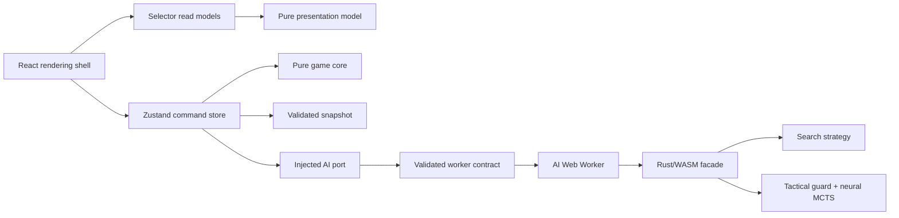
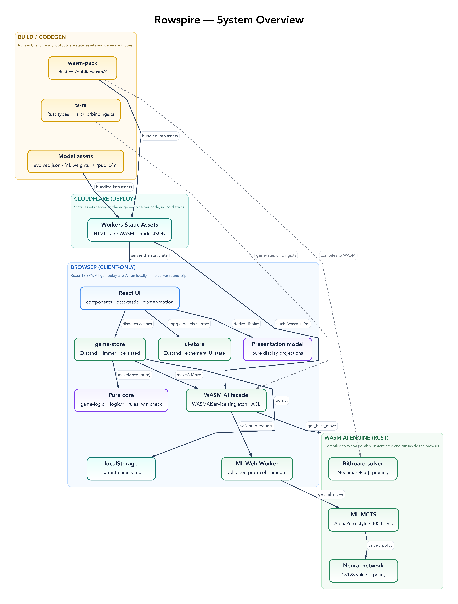
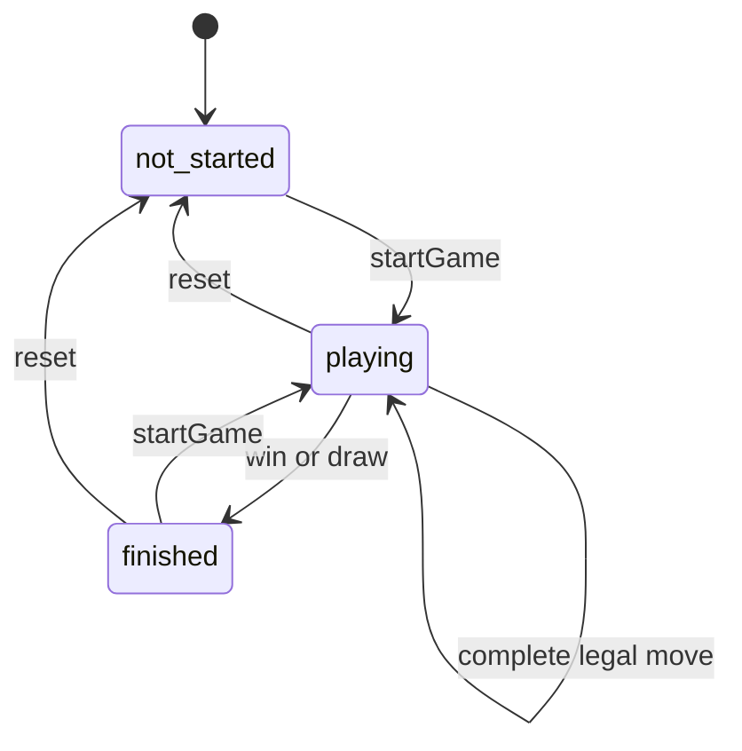
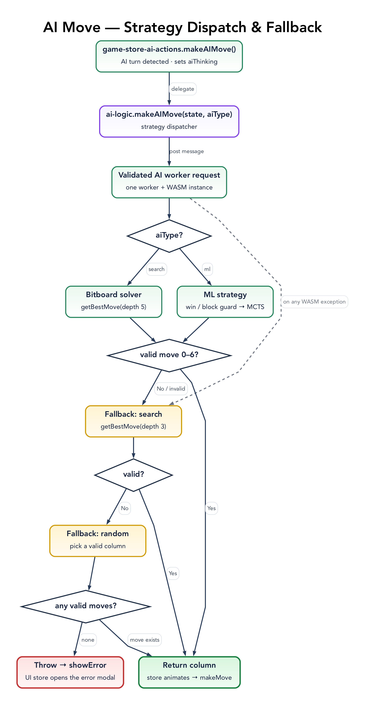
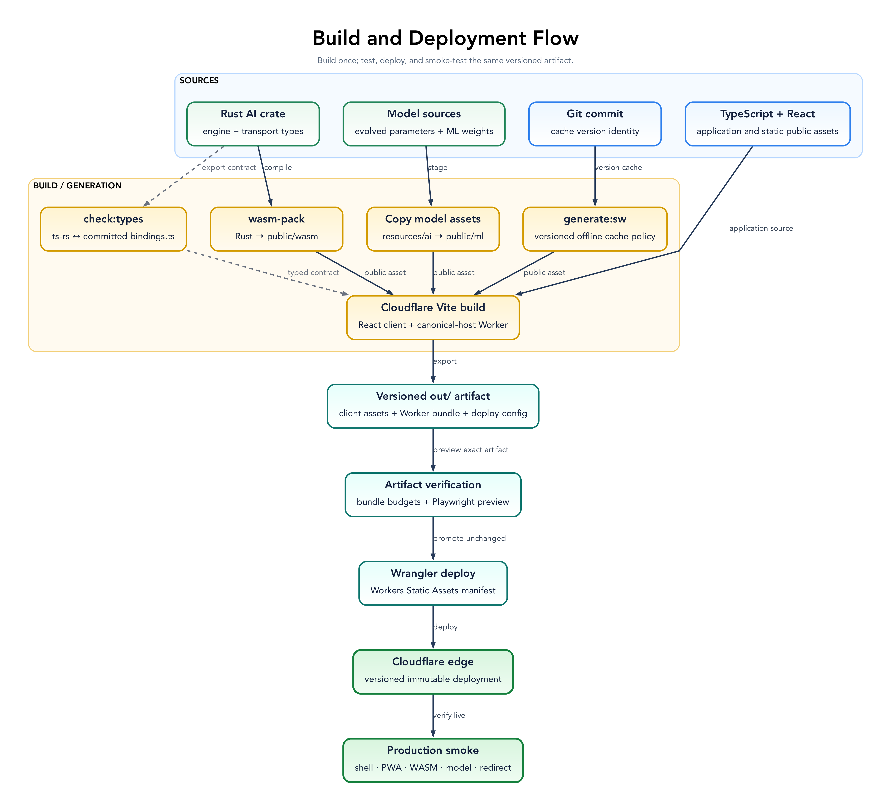

# Architecture

Rowspire is a browser-run game with no application API or server-side game state. Vite builds the React client; a small Cloudflare Worker canonicalizes hosts and serves Workers Static Assets. TypeScript owns the browser domain and application shell, while Rust/WebAssembly owns AI search and inference.

## System Shape

Dependencies point inward: the pure browser domain does not depend on React, Zustand, storage, workers, generated bindings, or WebAssembly.

## Pattern Catalog

| Pattern                           | Rule                                              | Implementation                                   | Enforcement                         |
| --------------------------------- | ------------------------------------------------- | ------------------------------------------------ | ----------------------------------- |
| Schema-first domain model         | Define browser-domain values once                 | `schemas.ts`, `types.ts`                         | Zod, strict TypeScript, import lint |
| Aggregate invariant               | Validate relationships, not only shape            | `game-state-invariants.ts`                       | Replay and malformed-state tests    |
| Functional core, imperative shell | Keep decisions pure and effects at edges          | `game-logic.ts`, `logic/*`, stores and adapters  | Dependency lint and Vitest          |
| Command store                     | Let UI issue named commands                       | `GameStore.actions`                              | Zustand + Immer                     |
| Selector read model               | Subscribe only to rendered state                  | Named and inline selectors                       | Zero-argument store-hook lint       |
| Explicit state machine            | Centralize turn and transition predicates         | `game-state-machine.ts`                          | State-machine and store tests       |
| Generation token                  | Reject stale asynchronous results                 | `gameGeneration`, `isSameTurn`                   | Async race tests                    |
| Presentation model                | Derive display semantics outside React            | `game-presentation.ts`                           | Pure tests and Playwright           |
| Ports and adapters                | Construct effects explicitly                      | `GameStoreDependencies`, AI adapters             | Store factory tests                 |
| Deterministic effects             | Inject clocks and randomness                      | Store dependencies and seeded Rust RNG           | Reproducibility tests               |
| Purposeful motion                 | Animate state changes and respect user preference | `visuals/motion.ts`, transform-based transitions | Playwright and reduced-motion tests |
| Contract-first boundary           | Validate both sides of cross-runtime calls        | `ai-worker-protocol.ts`, `wasm-ai-boundary.ts`   | Strict Zod protocol tests           |
| Strategy with fallback            | Degrade explicitly to another legal move source   | `ai-logic.ts`, Rust strategies                   | Exhaustive types and AI tests       |
| Versioned snapshot                | Persist only stable validated state               | `game-store-state.ts`                            | Migration and aggregate tests       |
| Privacy-filtered observability    | Make reporting optional and filter sensitive data | `observability.ts`, `AppErrorBoundary.tsx`       | Observability tests                 |
| Executable conformance            | Keep TypeScript and Rust rules aligned            | Shared rule fixtures                             | Vitest and Cargo tests              |
| Artifact promotion                | Test and deploy the same build output             | Vite/Cloudflare workflow                         | Production-preview Playwright       |
| Fitness function                  | Turn architectural constraints into release gates | Lint, types, tests, audits, docs, bundle         | `npm run check`                     |

## Domain and State

`schemas.ts` is the browser-domain source of truth and exports inferred types through `types.ts`. `GameStateSchema` replays history to enforce gravity, alternating players, board/history agreement, turn ownership, terminal state, and winning coordinates. Persistence accepts `unknown` and restores valid fields while defaulting invalid or missing fields.

Rust transport types are generated into `bindings.ts`. They are boundary contracts rather than browser-domain types: `wasm-ai-service.ts` translates browser state, and `wasm-ai-boundary.ts` validates the Rust-facing state and responses.

Pure functions own moves, wins, draws, transition predicates, and presentation decisions. The imperative shell owns storage, workers, timers, random sources, reporting, React events, and animation lifecycle. UI behavior is covered with Playwright; extracted decisions are covered with Vitest.

`createGameStore` builds a vanilla Zustand store from four injected effects: AI, wait, random, and error reporting. Production supplies browser adapters; tests supply deterministic substitutes. Zustand persistence stores only the game aggregate, mode, and AI selections under `rowspire-game-storage`; actions and transient state are reconstructed.

`pendingMove` and `aiThinking` are transient substates. A generation token invalidates delayed AI work after reset; an AI result commits only when its generation and turn identity still match.

## AI Boundary

The closed `AIType` model exposes two strategies:

| Strategy | Rust implementation                               | Role                                 |
| -------- | ------------------------------------------------- | ------------------------------------ |
| Search   | Bitboard negamax with alpha-beta pruning          | Tactical opponent and first fallback |
| ML       | Immediate win/block guard followed by neural MCTS | Learned policy/value exploration     |

Both strategies run in one `ai.worker.ts` instance off the React thread. The boundary is deliberately narrow:

- `ai-worker-protocol.ts` defines strict discriminated requests and responses.
- `wasm-ai-boundary.ts` validates transport state, model weights, and engine results.
- `ai-worker-client.ts` correlates requests, enforces timeouts, and replaces a failed worker.
- `wasm-ai-service.ts` translates domain state and caches genetic parameters.

The ML strategy loads separate value and policy networks with four 128-unit hidden layers. If stored weights cannot be loaded, it retains its initialized networks. Selected-strategy failure or an invalid result follows one fallback chain:

1. Shallow Search.
2. An injected random legal column.
3. A user-visible error when no legal move exists.

Random sources are injectable in TypeScript and seedable in Rust, including neural initialization and MCTS. Shared fixtures exercise legal moves, gravity, wins, and draws in both languages.

Source parameters and weights live in `resources/ai/`; builds stage runtime copies under `public/ml/`. `npm run train` enables the optional Rust training dependencies, reuses or generates the ignored dataset under `resources/ai/training/`, and replaces the source weights. It runs under `caffeinate`.

## Browser Boundaries

### Offline

`service-worker.ts` is typed source compiled into the versioned `public/sw.js` artifact. Application, WASM, and model assets use cache-first delivery; documents use network-first delivery with `/offline` as the final fallback. Registration, update prompts, install prompts, and network status remain in React.

### Motion

Shared timings live in `visuals/motion.ts`; UI transitions use transforms and opacity. The ambient canvas uses frame-rate-independent steps, pauses in hidden tabs, and renders a static frame when reduced motion is requested. Counter drops and win effects communicate state changes rather than decorating idle board elements.

### Observability

Sentry initializes only when `VITE_SENTRY_DSN` is present. Reporting disables default PII, removes request bodies and cookies, filters authorization and common sensitive fields, and queues transport while offline. The React error boundary provides a local recovery surface whether reporting is configured or not.

## Code Ownership

| Location                                                               | Responsibility                                          |
| ---------------------------------------------------------------------- | ------------------------------------------------------- |
| `src/components`, `src/hooks`                                          | Rendering, accessibility, events, and React lifecycle   |
| `src/lib/schemas.ts`, `types.ts`                                       | Browser-domain schemas and public type facade           |
| `src/lib/logic`, `game-logic.ts`, `game-state-machine.ts`              | Pure rules, transitions, and invariant validation       |
| `src/lib/game-store-core.ts`, `game-store-ai-actions.ts`               | Application commands over injected effects              |
| `src/lib/game-store.ts`, `game-store-state.ts`, `ui-store.ts`          | Store construction, persistence, and ephemeral UI state |
| `src/lib/*protocol.ts`, `*-boundary.ts`, `*-service.ts`, `*-client.ts` | External contracts and adapters                         |
| `src/lib/visuals`                                                      | Pure motion constants and canvas behavior               |
| `src/service-worker.ts`, `src/lib/service-worker-policy.ts`            | Offline runtime and cache policy                        |
| `worker/src/game.rs`, `rules.rs`, `bitboard.rs`                        | Rust game model and rules                               |
| `worker/src/search_ai.rs`, `solver.rs`                                 | Search strategy                                         |
| `worker/src/evaluation*.rs`, `feature*.rs`                             | Position evaluation and feature extraction              |
| `worker/src/ml_*.rs`, `mcts*.rs`, `network*.rs`, `neural_network.rs`   | ML strategy, MCTS, and networks                         |
| `worker/src/wasm_api.rs`                                               | Narrow WebAssembly facade                               |
| `worker/src/main.rs`, `worker/src/bin/train*`                          | Native evaluation and training commands                 |
| `resources/ai`                                                         | Source genetic parameters and ML weights                |
| `scripts`, `e2e`                                                       | Release safeguards and browser scenarios                |

Prefer code files under 200 lines and functions under 20 lines. Split by stable responsibility rather than arbitrary size.

## Build and Delivery

`check:types` temporarily regenerates Rust transport types and rejects drift from committed `bindings.ts`. `wasm-pack` compiles Rust into ignored `public/wasm`; source AI assets are copied into ignored `public/ml`; a dedicated Vite build emits `public/sw.js`. The Cloudflare Vite plugin then creates client assets plus the Worker bundle and deploy configuration under `out/`.

CI runs `npm run check`, previews the resulting production artifact for Playwright, deploys that unchanged output, and smoke-tests the live shell, manifest, WASM, ML weights, and canonical redirect. Concurrency cancellation prevents superseded `main` runs from deploying.

Graphviz owns complex architecture and branching flows; Mermaid stays inline for compact local relationships and state. See the [diagram guide](diagrams/README.md).

`npm run check` enforces strict ESLint and TypeScript, generated binding drift, Clippy with warnings denied, Rust/Vitest/conformance tests, coverage thresholds, internal documentation links and commands, diagram rendering, bundle budgets, branding, and production-preview Playwright.

## Deliberate Omissions

- A state-machine framework would duplicate the current closed types and predicates.
- CQRS, event sourcing, and a domain event bus do not fit one local aggregate without audit requirements.
- Repository abstractions are unnecessary for one versioned local snapshot.
- A dependency-injection container would obscure four explicit effects.
- Micro-frontends, an application API, and distributed-system patterns do not fit this static game.
- Preact or framework-free rendering would add migration risk without addressing a measured bottleneck.

Introduce a larger pattern only when its trigger exists, and document the trigger and trade-off here.
