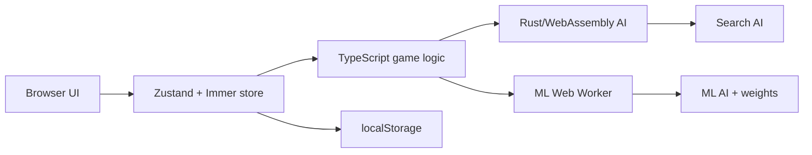

# Architecture

Rowspire is a static browser app. Gameplay, persistence, and AI all run client-side.

## Runtime Shape

## Frontend

- Next.js 15 static export with React 19 client components.
- Zustand stores own game and UI state.
- Immer keeps store updates concise without direct mutation.
- Domain types live in `src/lib/schemas.ts` and are re-exported through `src/lib/types.ts`.
- Brand identity lives in `src/lib/brand.ts` and feeds metadata, UI copy, and manifest generation.

## Game State

`GameState` contains the board, current player, status, winner, move history, and winning line. The persisted store uses `rowspire-game-storage`; only the active game state is persisted.

`AIType` is intentionally small: `search` or `ml`. `GameMode` controls human-vs-AI and AI-vs-AI flows.

## AI Boundary

- `src/lib/logic/ai-logic.ts` chooses the engine and owns tactical fallback behavior.
- `src/lib/wasm-ai-service.ts` loads `/wasm/rowspire_ai_core.js` on the main thread.
- `src/lib/ai.worker.ts` loads a separate WebAssembly instance for ML searches.
- Rust bindings are exported from `worker/src/wasm_api.rs` through the `RowspireAI` class.
- Shared TypeScript response types are generated into `src/lib/bindings.ts`.

Fallback order is primary engine, shallow Search AI, random valid column, then a user-visible error.

## Build Outputs

`npm run build:wasm-assets` creates ignored runtime assets:

- `public/wasm/rowspire_ai_core.js`
- `public/wasm/rowspire_ai_core_bg.wasm`
- `public/ml/data/...`

`npm run build` generates the service worker, builds those assets, exports the static site to `out/`, and runs the brand audit.

## Deployment

Wrangler serves `out/` with Workers Static Assets. There is no app server, server database, or server-side AI call.

## Diagrams

Source diagrams live in `docs/diagrams/*.dot`. Run `npm run diagrams` to render PNGs and `npm run check:diagrams` to verify generated diagram assets are current.

## Quality Gates

- `npm run lint`
- `npm run type-check`
- `npm run test`
- `npm run test:rust`
- `npm run test:e2e`
- `npm run brand:audit`
