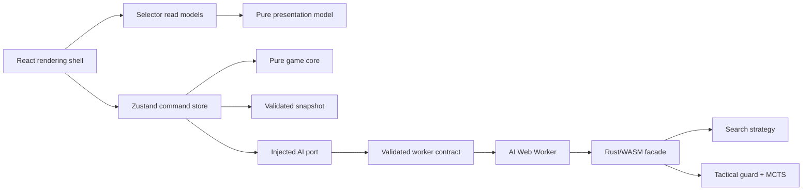
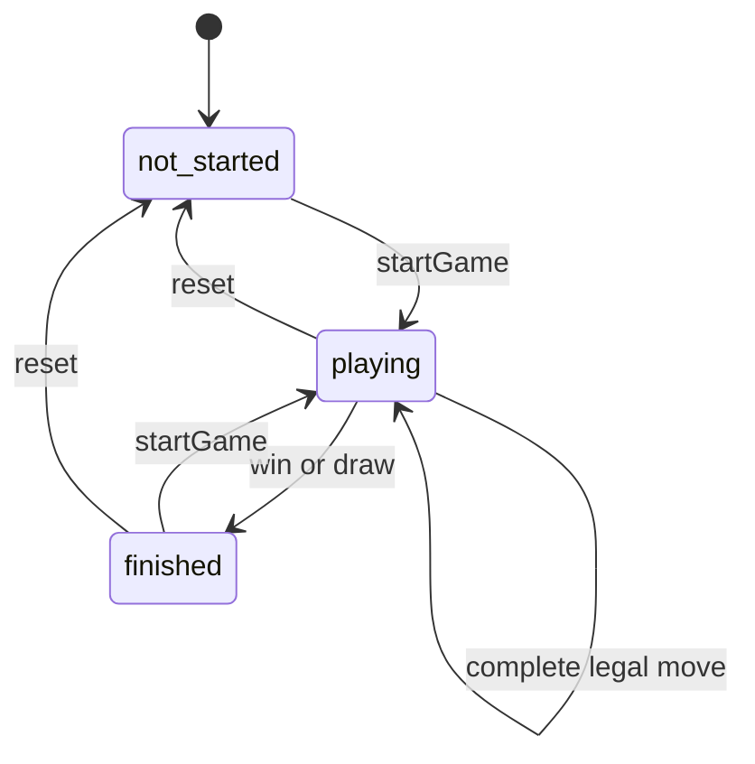

# Architecture

Rowspire is a static, client-only React game built by Vite and served through Cloudflare Workers Static Assets. TypeScript owns the browser domain and application shell; Rust/WebAssembly owns AI search and inference.

## System Shape

Dependencies point inward. The domain does not depend on React, Zustand, browser storage, workers, generated bindings, or WebAssembly. The detailed runtime view is maintained as Graphviz:

## Required Pattern Catalog

| Pattern                           | Rule                                              | Implementation                                   | Enforcement                         |
| --------------------------------- | ------------------------------------------------- | ------------------------------------------------ | ----------------------------------- |
| Schema-first domain model         | Define domain values once                         | `schemas.ts`, `types.ts`                         | Zod, strict TypeScript, import lint |
| Aggregate invariant               | Validate relationships, not only shape            | `game-state-invariants.ts`                       | Replay and malformed-state tests    |
| Functional core, imperative shell | Keep decisions pure and effects at edges          | `game-logic.ts`, `logic/*`, stores and adapters  | Dependency lint and Vitest          |
| Command store                     | UI issues named commands                          | `GameStore.actions`                              | Zustand + Immer                     |
| Selector read model               | Subscribe only to rendered state                  | Named and inline selectors                       | Zero-argument store-hook lint       |
| Explicit state machine            | Centralize turn and transition predicates         | `game-state-machine.ts`                          | State-machine and store tests       |
| Generation token                  | Reject stale asynchronous results                 | `gameGeneration`, `isSameTurn`                   | Async race tests                    |
| Presentation model                | Derive semantics outside React                    | `game-presentation.ts`                           | Pure tests and Playwright           |
| Ports and adapters                | Construct effects explicitly                      | `GameStoreDependencies`, `wasm-ai-service.ts`    | Store factory tests                 |
| Deterministic effects             | Inject clocks and randomness                      | Store dependencies and seeded Rust RNG           | Reproducibility tests               |
| Contract-first boundary           | Validate both sides of cross-runtime calls        | `ai-worker-protocol.ts`, `wasm-ai-boundary.ts`   | Strict Zod protocol tests           |
| Strategy with fallback            | Select engines explicitly and degrade predictably | `ai-logic.ts`, Rust strategies                   | Exhaustive types and AI tests       |
| Versioned snapshot                | Persist only stable, validated state              | `game-store-state.ts`                            | Migration and aggregate tests       |
| Executable conformance            | Keep TypeScript and Rust rules aligned            | Shared rule fixtures                             | Vitest and Cargo tests              |
| Artifact promotion                | Build once, test and deploy the same output       | Vite/Cloudflare workflow                         | Playwright production preview       |
| Fitness function                  | Turn architecture constraints into gates          | lint, types, coverage, bundle and diagram audits | `npm run check`                     |

## Domain and Application Patterns

### Schema-first aggregate

`schemas.ts` is the domain source of truth and exports inferred types through `types.ts`. A valid `GameState` must also satisfy aggregate invariants: gravity, alternating history, board/history agreement, current turn, terminal result and winning coordinates. Persistence accepts `unknown`, validates once and passes trusted values inward.

Generated Rust transport types in `bindings.ts` are boundary contracts, not browser-domain types. `wasm-ai-boundary.ts` validates and translates between the models.

### Functional core and command shell

Pure functions own moves, wins, draws, turn rules and display decisions. The shell owns effects:

- The Zustand store coordinates commands and asynchronous turns.
- `wasm-ai-service.ts` translates domain state and caches fetched parameters.
- `ai-worker-client.ts` owns worker lifecycle, correlation, timeout and failure fan-out.
- React owns rendering, accessibility, animation timing and user events.

UI components do not receive unit tests. Extract decisions into `src/lib`, test them with Vitest and cover rendered behavior with Playwright.

### Store ports and race safety

`createGameStore` builds a vanilla Zustand store from four small ports: AI, wait, random and error reporting. Production supplies browser adapters; tests supply deterministic functions. This is dependency injection without a container.

`GameStatus`, `GameMode`, current player and pending move form a small state machine represented by closed types and shared predicates:

`pendingMove` and `aiThinking` are transient substates. A generation token invalidates delayed AI work after reset, and a result commits only when its generation and turn identity still match.

## Boundary Patterns

### Unified AI worker

Search and ML use one worker, one WebAssembly instance and one discriminated protocol. Requests validate the full 7×6 board, player and genetic parameters. Rust results are validated before posting, and the client validates them again before resolving a request. Invalid fatal responses reject all pending work and replace the worker on demand.

The AI strategy fallback is fixed:

1. Selected Search or ML strategy.
2. Shallow Search strategy.
3. Seedable random valid column.
4. User-visible error when no move exists.

### Versioned persistence

`rowspire-game-storage` contains only the game aggregate, mode and AI selections. Actions, animation state, pending work and errors are reconstructed. Incompatible changes increment `LATEST_VERSION` and require migration tests.

### Offline boundary

`service-worker.ts` is a generated, versioned module whose cache decisions live in `service-worker-policy.ts`. Static application, WASM and model assets are cache-first; documents are network-first with an offline fallback. Registration and update UI stay in React rather than inline scripts.

## Code Ownership

| Location                                                               | Responsibility                                       |
| ---------------------------------------------------------------------- | ---------------------------------------------------- |
| `src/components`                                                       | Rendering, accessibility, event wiring and animation |
| `src/hooks`                                                            | Reusable React lifecycle coordination                |
| `src/lib/schemas.ts`, `types.ts`                                       | Domain schemas and public domain facade              |
| `src/lib/logic`, `game-logic.ts`                                       | Pure rules and invariant validation                  |
| `src/lib/game-store-core.ts`                                           | Application commands over injected ports             |
| `src/lib/game-store.ts`                                                | Production store construction and persistence        |
| `src/lib/*protocol.ts`, `*-boundary.ts`, `*-service.ts`, `*-client.ts` | External contracts and adapters                      |
| `src/service-worker.ts`                                                | Offline runtime shell                                |
| `worker/src/game.rs`, `rules.rs`                                       | Rust game model and rules                            |
| `worker/src/search_ai.rs`, `ml_ai.rs`, `mcts.rs`                       | AI strategies                                        |
| `worker/src/wasm_api.rs`                                               | Narrow WebAssembly facade                            |
| `scripts`                                                              | Generation, audits and delivery support              |

Prefer code files under 200 lines and functions under 20 lines. Split by stable responsibility, not arbitrary size.

## Patterns Not Warranted

- A state-machine framework would duplicate the current closed types and predicates.
- CQRS, event sourcing and a domain event bus do not fit one local aggregate without audit requirements.
- Repository abstractions are unnecessary with one versioned local snapshot.
- A dependency-injection container would obscure four explicit ports.
- Micro-frontends, an application server and distributed-system patterns do not fit a static game.
- Preact compatibility or framework-free rendering would add ecosystem and lifecycle risk without addressing a measured bottleneck.

Introduce a larger pattern only when its trigger exists, and document both the trigger and trade-off here.

## Build and Deployment

`wasm-pack` compiles Rust into `public/wasm`; source model assets are staged into `public/ml`; a dedicated Vite build emits the versioned service worker. The Cloudflare Vite plugin then creates `out/client` and a Worker bundle/config under `out/rowspire_main`.

CI validates source, builds once, previews that exact artifact for Playwright, deploys the same artifact and smoke-tests production. Concurrency cancellation prevents an older `main` run deploying after a newer one.

Graphviz sources live in `docs/diagrams/*.dot`; Mermaid is reserved for compact local flows. Run `npm run diagrams` after changing Graphviz and `npm run check:diagrams` to validate style and rendering.

## Architecture Fitness Functions

`npm run check` enforces:

- ESLint dependency direction, Zustand selectors and type-only imports.
- Strict TypeScript and generated Rust binding drift.
- Strict Clippy across targets and features.
- Vitest coverage and shared TypeScript/Rust rule conformance.
- Rust AI matrix behavior.
- Bundle budgets for JavaScript, CSS, WASM and model JSON.
- Branding, Graphviz source and render checks.
- Playwright against the production Cloudflare/Vite artifact.

Deployment adds live HTML, manifest, WASM, model and canonical-host smoke checks.
