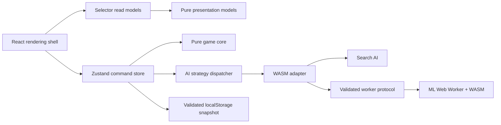

# Architecture

Rowspire is a static, client-only game. React renders projections of Zustand state, pure TypeScript owns game rules, and adapters isolate persistence, Web Workers, and Rust/WebAssembly.

## System Shape

Dependencies point inward toward the domain. Components may depend on stores, presentation models, and domain types. The domain never depends on React, Zustand, browser storage, workers, or generated WASM bindings.

## Required Pattern Catalog

| Pattern                           | Rule                                                           | Primary implementation                                           | Enforcement                                               |
| --------------------------------- | -------------------------------------------------------------- | ---------------------------------------------------------------- | --------------------------------------------------------- |
| Schema-first domain model         | Define domain values once and import them through one facade   | `src/lib/schemas.ts`, `src/lib/types.ts`                         | Strict TypeScript, Zod tests, restricted-import lint rule |
| Functional core, imperative shell | Keep decisions pure; keep effects at adapters and stores       | `game-logic.ts`, `game-state-machine.ts`, `logic/board-logic.ts` | Layer lint rules; Vitest covers extracted logic           |
| Command store                     | Components issue named commands rather than constructing state | `GameStore.actions`                                              | Zustand + Immer                                           |
| Selector read model               | Every component subscribes only to the state it renders        | `useGameState`, `useGameActions`, inline selectors               | Lint rejects zero-argument store hooks                    |
| Explicit state machine            | Turn eligibility and transitions use shared predicates         | `src/lib/game-state-machine.ts`                                  | State-machine and store tests                             |
| Generation token                  | Delayed work must prove it still belongs to the active game    | `gameGeneration` and `isSameTurn`                                | Async store tests                                         |
| Presentation model                | Derive text, tone, and semantic icons outside React            | `src/lib/game-presentation.ts`                                   | Pure unit tests; components only map semantics to UI      |
| Contract-first boundary           | Validate every untrusted or cross-runtime message              | `src/lib/ml-ai-worker-protocol.ts`                               | Shared Zod schemas on both worker sides                   |
| Adapter / anti-corruption layer   | Browser and Rust representations do not leak into the domain   | `src/lib/wasm-ai-service.ts`, generated `bindings.ts`            | Conversion occurs at the adapter edge                     |
| Strategy with fallback            | Select an AI explicitly and degrade in a fixed order           | `logic/ai-logic.ts`, `worker/src/ml_ai.rs`                       | Exhaustive `AIType`; TypeScript and Rust AI tests         |
| Versioned snapshot                | Persist only stable state and validate on restore              | `src/lib/game-store-state.ts`                                    | Schema validation and migration tests                     |
| Generated artifact boundary       | Generated and build outputs are never hand-edited              | `bindings.ts`, `public/wasm`, `out`                              | Generation scripts and ignore files                       |

## Pattern Details

### Schema-first domain model

`src/lib/schemas.ts` is the source of truth for game-domain values. Every schema exports its inferred TypeScript type, eliminating parallel interfaces. Application code imports schemas and types from `src/lib/types.ts`; only schema-focused tests and that facade import `schemas.ts` directly.

Generated Rust transport types remain in `src/lib/bindings.ts`. They are boundary contracts, not domain types, and are translated by adapters before reaching game logic.

When adding a domain value:

1. Add or extend its Zod schema.
2. Infer the type from the schema.
3. Re-export both through `types.ts`.
4. Validate the value at input and persistence boundaries.

### Functional core, imperative shell

Pure functions own board updates, win detection, turn rules, and presentation decisions. Rust owns AI tactics and search. These modules accept values and return values without reading stores or browser globals.

The shell owns effects:

- Zustand coordinates commands and asynchronous turns.
- `wasm-ai-service.ts` loads modules and model data.
- `ml-ai-worker-client.ts` owns worker lifecycle and timeouts.
- React owns rendering, animation timing, and user events.

New decision logic belongs in `src/lib`; a component should normally choose only which pure result to render.

### Command store and selector read models

The game store is the application coordinator. Components call stable actions such as `makeMove`, `completeMove`, `makeAIMove`, and `reset`. Store updates use Immer and preserve the action vocabulary.

Store reads always use a selector. Whole-store subscription is prohibited because it hides dependencies and causes unrelated renders. Repeated or meaningful selections should become named hooks; one-off scalar selections may remain inline.

Transient display-only state stays local to a component unless several unrelated components coordinate through it. Shared ephemeral UI state belongs in `ui-store`; game state never does.

### Explicit state machine and race guards

`GameStatus`, `GameMode`, the current player, and pending move form a small state machine. Shared predicates answer whether a human or AI may act and whether a pending result is current. Components and effects must not reproduce those rules.

The state machine is intentionally represented by typed values and predicates rather than a framework. A generation token invalidates delayed AI work after reset or replacement. The result is committed only when the generation and turn identity still match.

### Presentation model

`game-presentation.ts` converts game and AI state into semantic display values. React maps those values to Lucide icons and Tailwind classes. This keeps copy and outcome rules consistent between status and completion views while allowing animation and markup to remain component concerns.

Do not unit-test UI components. Extract decisions into a presentation model or another pure library function, test that function with Vitest, and cover the rendered flow with Playwright.

### Contract-first worker boundary

Worker messages are untrusted even though both ends are in this repository. `ml-ai-worker-protocol.ts` defines request, success, error, and ML response schemas. The client and worker both import that contract:

- Requests are checked before invoking WASM.
- Engine output is checked before posting it.
- Client responses are checked before resolving a pending request.
- Invalid, failed, or timed-out workers are terminated and recreated on demand.

The same rule applies to local storage, fetched JSON, generated WASM responses, URL state, and future network calls: accept `unknown`, validate once at the edge, and pass trusted types inward.

### Adapter and AI strategy patterns

`wasm-ai-service.ts` is an anti-corruption layer between camel-case TypeScript domain state and the generated Rust/WASM representation. No component imports generated bindings or calls WASM directly.

`AIType` is a closed strategy set: `search` or `ml`. Dispatch is exhaustive, so adding an AI type creates compile errors at every required mapping. The failure chain is deterministic:

1. Selected engine.
2. Shallow Search AI.
3. Random valid column.
4. User-visible error when no valid move exists.

The Rust ML strategy checks immediate wins, then immediate blocks, before invoking MCTS. Assertion-based Rust tests protect both tactical guarantees independently of model weights.

### Versioned persistence

The persisted key is `rowspire-game-storage`. Only the current game, mode, and AI selections are stored. Animation state, pending moves, actions, errors, and loading flags are reconstructed.

`parsePersistedState` validates each field and supplies safe defaults for missing or malformed legacy data. Any incompatible change increments `LATEST_VERSION` and adds a migration test.

## Code Ownership

| Location                                              | Responsibility                                         |
| ----------------------------------------------------- | ------------------------------------------------------ |
| `src/components`                                      | Rendering, accessibility, event wiring, animation      |
| `src/hooks`                                           | Reusable React lifecycle coordination                  |
| `src/lib/schemas.ts`                                  | Domain schemas and inferred domain types               |
| `src/lib/types.ts`                                    | Public domain-model facade                             |
| `src/lib/game-logic.ts`, `logic/board-logic.ts`       | Pure game rules                                        |
| `src/lib/logic/ai-logic.ts`                           | Effectful AI strategy dispatch and fallback            |
| `src/lib/game-state-machine.ts`                       | Turn and transition predicates                         |
| `src/lib/game-presentation.ts`                        | Pure UI projections                                    |
| `src/lib/*-store.ts`                                  | Commands, state coordination, persistence wiring       |
| `src/lib/*protocol.ts`, `*-service.ts`, `*-client.ts` | External boundary contracts and adapters               |
| `worker`                                              | Rust AI engine and training code                       |
| `scripts`                                             | Build, code generation, audits, and deployment support |

Prefer files under 200 lines and functions under 20 lines. Split by responsibility, not by arbitrary size: a useful extraction creates a named pattern boundary and a unit-testable API.

## Patterns Not Currently Warranted

The audit found and added three missing patterns: a shared worker contract, selector-only store reads, and a presentation model. Larger patterns would currently add indirection without solving an observed problem:

- A state-machine library is unnecessary while typed predicates describe every transition clearly.
- CQRS, event sourcing, and a domain event bus are unnecessary for one local aggregate with no audit or replay requirement.
- Repository interfaces are unnecessary while there is one versioned local snapshot and no interchangeable data source.
- A dependency-injection container is unnecessary while adapters are few, explicit, and easy to replace in tests.
- Micro-frontends, server layers, and distributed-system patterns do not fit a static client-only game.

Introduce one of these only when its trigger appears: multiple implementations, replay or audit requirements, independently deployed domains, or dependency construction that is no longer explicit. Name the pattern and its trade-off here when adopting it.

## Build and Deployment

`npm run build:wasm-assets` compiles Rust to `public/wasm` and copies model assets to `public/ml`. `npm run build` generates the service worker, builds the static export in `out`, and runs the brand audit. Wrangler serves `out` through Workers Static Assets; there is no app server, database, or server-side AI call.

Source diagrams live in `docs/diagrams/*.dot`. Run `npm run diagrams` after changing a diagram and `npm run check:diagrams` to verify rendered assets.

## Architecture Fitness Functions

`npm run check` is the executable architecture policy. It runs:

- ESLint, including selector and dependency-direction boundaries.
- Strict TypeScript with unchecked-index and optional-property checks.
- Strict Clippy across Rust targets and features.
- Vitest coverage for pure logic and adapters.
- Rust AI matrix tests.
- Brand and generated-output audits.
- Architecture diagram source and render validation.
- Playwright end-to-end flows.

ESLint enforces three dependency directions: library code cannot import UI, UI cannot import generated bindings or worker/WASM adapters, and the pure core cannot import stores, UI frameworks, the AI shell, or external adapters.
